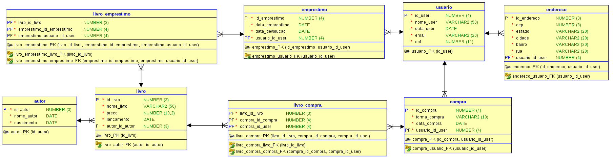

# 📌 BibliotecaELM - Checkpoint 02

## 🎯 Sobre o Projeto (Domínio Escolhido)
Este projeto é uma API em .NET desenvolvida seguindo os princípios de **Clean Architecture**, abordando o domínio de uma **Biblioteca**. O sistema gerencia o serviço clássico de empréstimos (locação de acervo físico) e transações de compras/aquisição de livros em definitivo pelos usuários.

Este projeto iniciou-se no **Checkpoint 01 (CP1)** focado na modelagem do Domínio (MER) e agora evoluiu no **Checkpoint 02 (CP2)** com a inclusão de acesso a dados (**Entity Framework Core**), camada de **Infrastructure**, Mapeamento Fluent API e criação do banco por meio de **Migrations**.

## Integrantes da Equipe

<table>
<tr>
<th>Nome</th>
<th>RM</th>
<th>Turma</th>
<th>GitHub</th>
<th>LinkedIn</th>
</tr>

<tr>
<td>Enzo Okuizumi</td>
<td>561432</td>
<td>2TDSPG</td>
<td><a href="https://github.com/EnzoOkuizumiFiap">EnzoOkuizumiFiap</a></td>
<td><a href="https://www.linkedin.com/in/enzo-okuizumi-b60292256/">Enzo Okuizumi</a></td>
</tr>

<tr>
<td>Lucas Barros Gouveia</td>
<td>566422</td>
<td>2TDSPG</td>
<td><a href="https://github.com/LuzBGouveia">LuzBGouveia</a></td>
<td><a href="https://www.linkedin.com/in/lucas-barros-gouveia-09b147355/">Lucas Barros Gouveia</a></td>
</tr>

<tr>
<td>Milton Marcelino</td>
<td>564836</td>
<td>2TDSPG</td>
<td><a href="https://github.com/MiltonMarcelino">MiltonMarcelino</a></td>
<td><a href="http://linkedin.com/in/milton-marcelino-250298142">Milton Marcelino</a></td>
</tr>

</table>

---

## 🧱 Arquitetura e Estrutura do Projeto (Checkpoin 02)

Esta entrega foi refatorada para comportar persistência e a lógica em camadas separadas:
1. **API (`BibliotecaELM.API`)**: Controladores e injeção de dependência (`Program.cs`).
2. **Application (`BibliotecaELM.Application`)**: Serviços (interfaces de repositório) e DTOs.
3. **Domain (`BibliotecaELM.Domain`)**: Entidades de domínio originárias do CP1 e classe base `BaseEntity`.
4. **Infrastructure (`BibliotecaELM.Infrastructure`)**: 
   - `DbContext` (`BibliotecaElmContext`) persistindo o contexto com **Oracle**.
   - Mapeamentos das entidades usando **Fluent API** (ex. `IEntityTypeConfiguration<T>`).
   - Implementações correspondentes aos Repositórios Genéricos / Agregados.
   - Migrations do Entity Framework.

### 💾 Persistência e Banco de Dados
Para o escopo do **CP2**, utilizamos:
- **SGBD**: Banco de Dados **Oracle** (`Oracle.EntityFrameworkCore`).
- **ORM Configurado**: Entity Framework Core 9/10.

#### Como Executar e aplicar as Migrations:
> Execute os comandos abaixo a partir da raiz do repositorio.

1. Inicialize o User Secrets no projeto da API (uma vez por maquina):
   ```bash
   dotnet user-secrets init --project BibliotecaELM/BibliotecaELM.API
   ```
2. Configure a connection string do Oracle no User Secrets (sem commitar senha no repositorio):
   ```bash
   dotnet user-secrets set "ConnectionStrings:BibliotecaElmOracle" "Data Source=oracle.fiap.com.br:1521/orcl;User ID=SEU_USUARIO;Password=SUA_SENHA;" --project BibliotecaELM/BibliotecaELM.API
   ```
3. Pelo terminal, aplique a migration no banco:
   ```bash
   dotnet ef database update --project BibliotecaELM/BibliotecaELM.Infrastructure --startup-project BibliotecaELM/BibliotecaELM.API
   ```

### 🧾 Estratégia de Migrations (CP2)
Para manter o historico enxuto e aderente ao critério do CP2 (maximo de duas migrations), o projeto adota uma migration consolidada para o esquema final do MER no checkpoint.

**Se precisar recriar do zero em ambiente local:**

```bash
dotnet ef migrations remove --project BibliotecaELM/BibliotecaELM.Infrastructure --startup-project BibliotecaELM/BibliotecaELM.API
# repetir enquanto houver migrations pendentes
dotnet ef migrations add InitialCp2 --project BibliotecaELM/BibliotecaELM.Infrastructure --startup-project BibliotecaELM/BibliotecaELM.API
dotnet ef database update --project BibliotecaELM/BibliotecaELM.Infrastructure --startup-project BibliotecaELM/BibliotecaELM.API
```

---

## 📚 Entidades Modeladas
Todas as entidades listadas abaixo (originadas no CP1) implementam a classe abstrata `BaseEntity` utilizando o identificador único padrão (`Id` do tipo `Guid`).

- **Usuario**: Representa os leitores/clientes da biblioteca.
- **Endereco**: Representa a localização de residência do usuário.
- **Livro**: Representa as obras literárias e físicas da biblioteca.
- **Autor**: Representa os escritores responsáveis pelas obras.
- **Emprestimo**: Representa o ato transacional (histórico) onde o usuário leva o livro temporariamente com prazos definidos.
- **Compra**: Representa a transação comercial onde o usuário adquire livros em definitivo.

---

## 🔗 Resumo dos Relacionamentos

Baseado na modelagem e devidamente mapeados com EF Core no CP2:

- **Usuario (1) ↔ (1) Endereco**
  - Relacionamento 1:1 com endereço opcional no usuário. O usuário pode existir sem endereço, mas cada endereço pertence a exatamente um usuário (FK `UsuarioId` com índice único em `BD_Addresses`).
- **Usuario (1) ↔ (N) Emprestimo**
  - Relacionamento 1:N obrigatório. Um usuário pode ter vários empréstimos e todo empréstimo exige um usuário vinculado (`UsuarioId` obrigatório em `BD_Loans`).
- **Usuario (1) ↔ (N) Compra**
  - Relacionamento 1:N obrigatório. Um usuário pode efetuar inúmeras compras e toda compra exige um usuário vinculado (`UsuarioId` obrigatório em `BD_Purchases`).
  - Regra de negócio: usuário sem endereço não pode realizar compra.
- **Livro (N) ↔ (N) Emprestimo**
  - Relacionamento N:N implementado por tabela de junção `BD_LoanBooks`.
- **Autor (1) ↔ (N) Livro**
  - Relacionamento 1:N obrigatório. Um autor possui vários livros e todo livro exige um autor (`AutorId` obrigatório em `BD_Books`).
- **Compra (N) ↔ (N) Livro**
  - Relacionamento N:N implementado por tabela de junção `BD_PurchaseBooks`.

## ✅ Regras de Negócio Implementadas

- Cadastro de usuário permite endereço opcional.
- No update de usuário, quando `endereco` vier `null`, o endereço atual é mantido sem alteração.
- Compras são bloqueadas para usuários sem endereço cadastrado.
- Compras não aceitam `dataCompra` futura.
- Empréstimos não aceitam `dataEmprestimo` futuras.
- Autor possui validação de faixa para `nascimento` (1500 a 2026).

## 🗂️ Evidências de Banco e Migrations

## MER



## Tabela de histórico de migrations


## Estrutura das tabelas principais

### Tabela BD_User


### Tabela BD_Address


### Tabela Purchases


### Tabela BD_Loans


### Tabela BD_Books


### Tabela BD_Authors


### Tabela BD_PurchasesBooks


### Tabela BD_LoanBooks


## 🖼️ Evidências de Testes (Insomnia)

### Usuario

**POST**


**GET**


**GET By Id**


**PUT**


**DELETE**


### Endereco

**POST**


**GET**


**GET By Id**


**PUT**


**DELETE**


### Compra

**POST (válido)**


**POST (bloqueio sem endereço)**


**GET**


**GET By Id**


**PUT**


**DELETE**


### Emprestimo

**POST**


**GET**


**GET By Id**


**PUT**


**DELETE**


### Livro

**POST**


**GET**


**GET By Id**


**PUT**


**DELETE**


### Autor

**POST**


**GET**


**GET By Id**


**PUT**


**DELETE**


