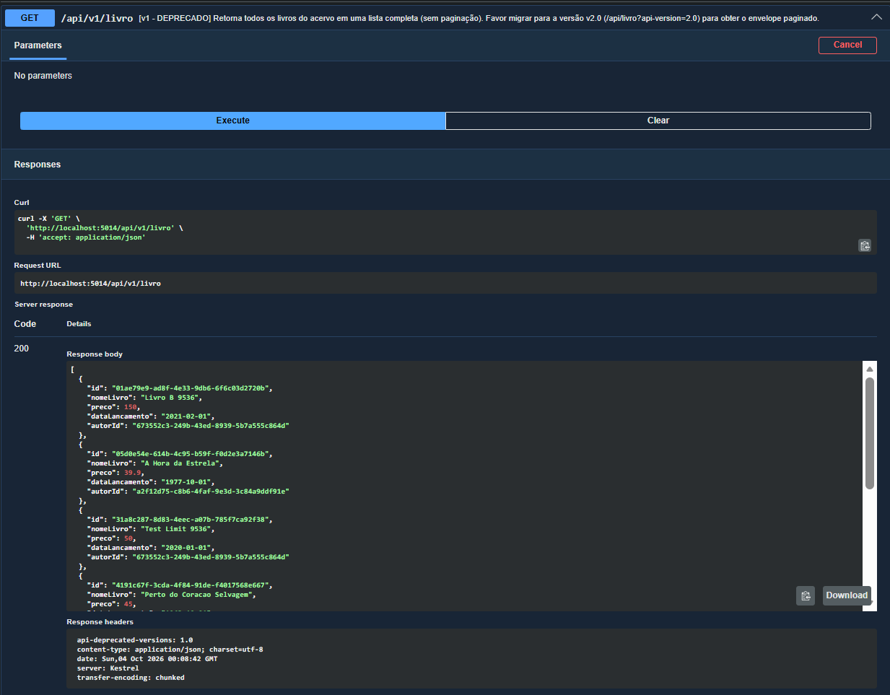
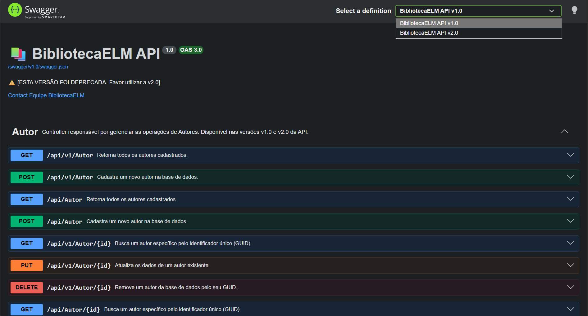
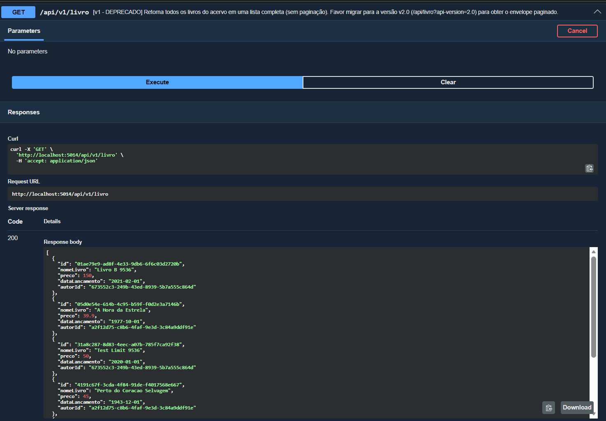
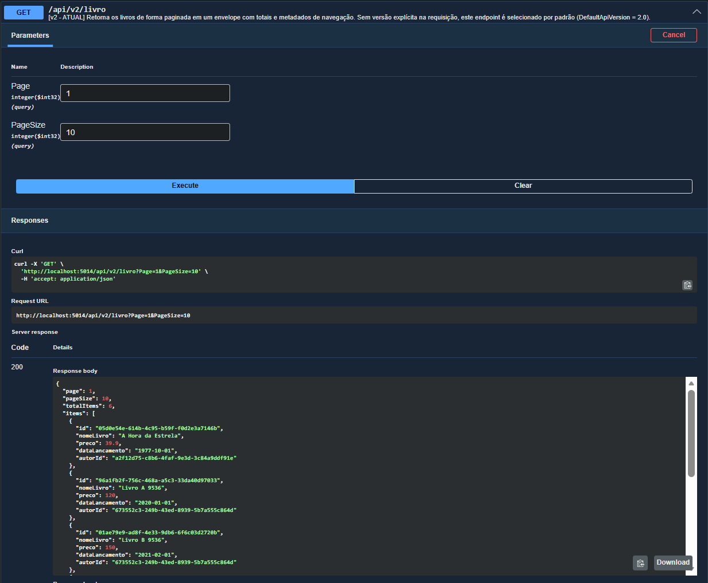
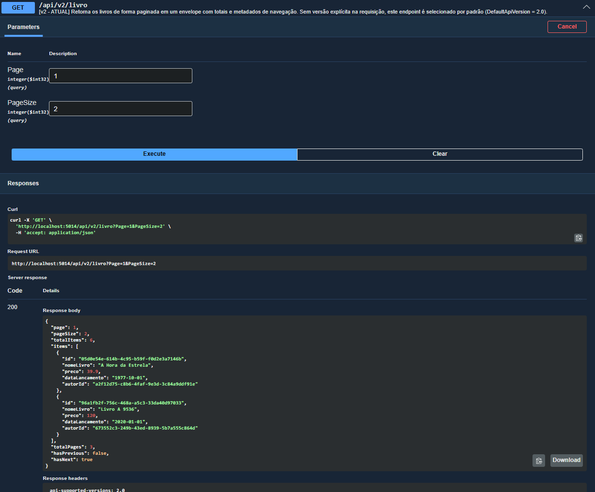
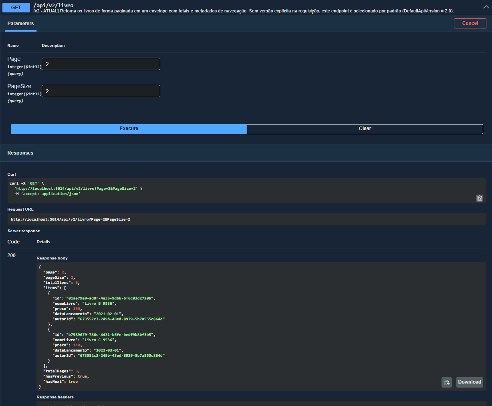
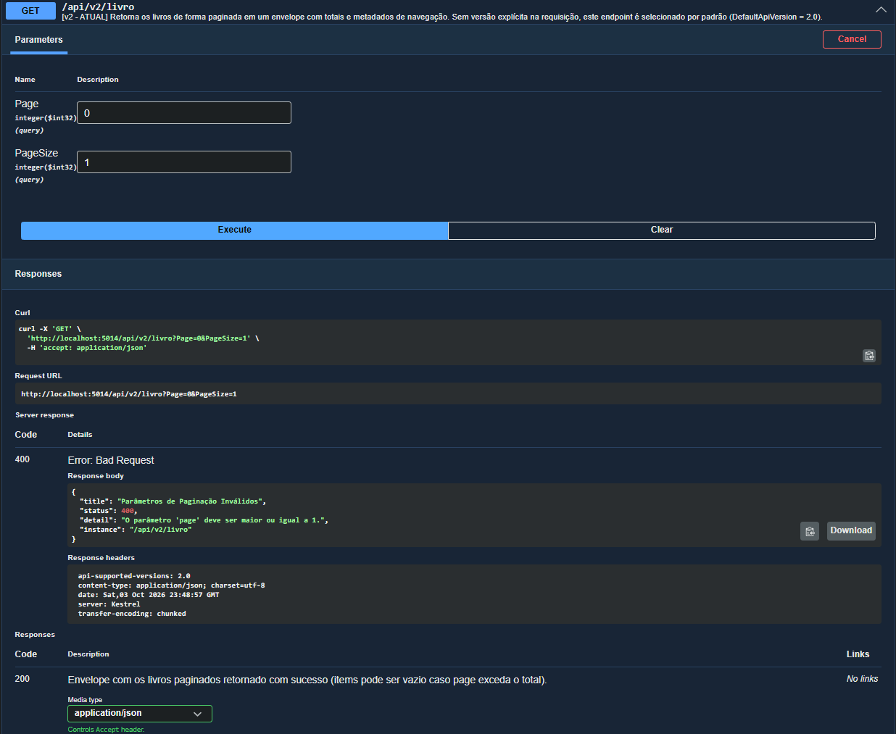
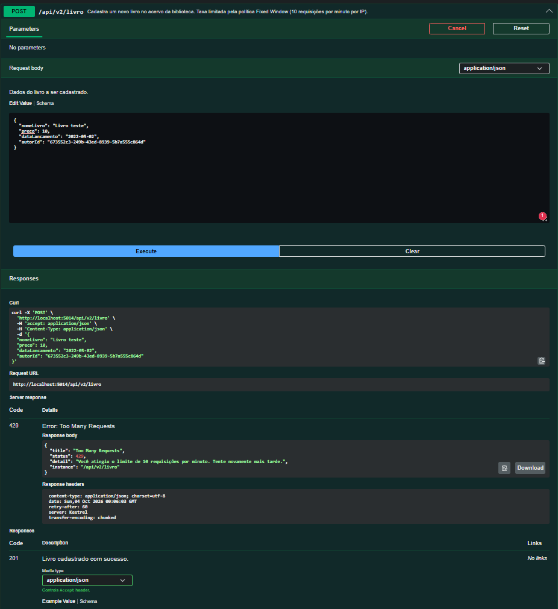
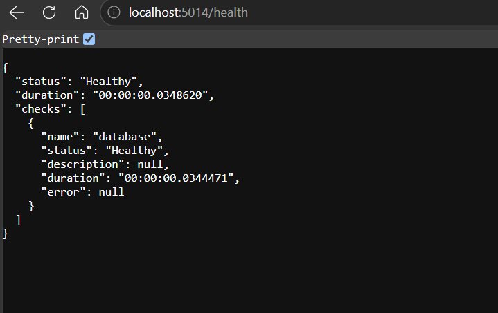
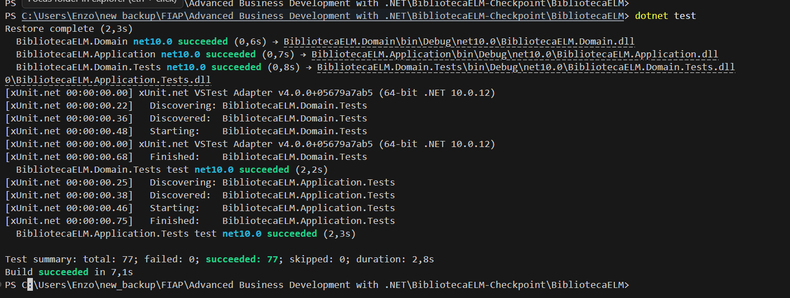

# 📌 BibliotecaELM — Checkpoint 05

## 🎯 Sobre o Projeto (Domínio Escolhido)

Este projeto é uma API REST em .NET desenvolvida seguindo os princípios de **Clean Architecture**, abordando o domínio de uma **Biblioteca**. O sistema gerencia o serviço clássico de empréstimos (locação de acervo físico) e transações de compras/aquisição de livros em definitivo pelos usuários.

O projeto foi evoluído ao longo dos CPs:

| CP | Entrega |
|----|---------|
| CP1 | MER + entidades em C# |
| CP2 | Esquema físico + EF Core + Migrations (Oracle) |
| CP3 | API REST + Swagger + `IRepository<T>` + `GlobalExceptionHandler` |
| CP4 | Health Checks + Logs estruturados com `traceId` + Testes xUnit/Moq |
| CP5 | Versionamento de API (v1/v2) + Paginação (IQueryable) + Rate Limiting (Fixed Window) |

---

## 👥 Integrantes da Equipe

<table>
<tr>
<th>Nome</th>
<th>RM</th>
<th>Turma</th>
<th>GitHub</th>
<th>LinkedIn</th>
</tr>

<tr>
<td>Enzo Okuizumi</td>
<td>561432</td>
<td>2TDSPG</td>
<td><a href="https://github.com/EnzoOkuizumiFiap">EnzoOkuizumiFiap</a></td>
<td><a href="https://www.linkedin.com/in/enzo-okuizumi-b60292256/">Enzo Okuizumi</a></td>
</tr>

<tr>
<td>Lucas Barros Gouveia</td>
<td>566422</td>
<td>2TDSPG</td>
<td><a href="https://github.com/LuzBGouveia">LuzBGouveia</a></td>
<td><a href="https://www.linkedin.com/in/lucas-barros-gouveia-09b147355/">Lucas Barros Gouveia</a></td>
</tr>

<tr>
<td>Milton Marcelino</td>
<td>564836</td>
<td>2TDSPG</td>
<td><a href="https://github.com/MiltonMarcelino">MiltonMarcelino</a></td>
<td><a href="http://linkedin.com/in/milton-marcelino-250298142">Milton Marcelino</a></td>
</tr>

</table>

**SGBD:** Oracle (via `Oracle.EntityFrameworkCore`)

---

## 🧭 Escopo e Entregas do Checkpoint 05 (CP5)

### 1. Versionamento de API (recurso: `Livro`)

O recurso `Livro` (`GET /api/livro`) possui **dois contratos simultâneos**:

| Versão | Status | Listagem | Rota |
|--------|--------|----------|------|
| **v1.0** | ⚠️ Deprecada | Array completo (sem paginação) — compatibilidade com clientes legados | `GET /api/v1/livro` |
| **v2.0** | ✅ Atual (padrão) | Envelope paginado com metadados | `GET /api/v2/livro` |

Os dois contratos **compartilham o mesmo serviço de aplicação** (`LivroService`). Nenhuma regra de negócio foi duplicada.

Os demais recursos (`Autor`, `Usuario`, `Compra`, `Emprestimo`, `Endereco`) estão marcados com `[ApiVersion("1.0")]` e `[ApiVersion("2.0")]` e permanecem 100% funcionais em ambas as versões.

### 2. Como Informar a Versão

| Método | Exemplo | Comportamento |
|--------|---------|---------------|
| **Query string** | `GET /api/livro?api-version=1.0` | v1 — lista completa |
| **Header** | `GET /api/livro` + `X-Api-Version: 1.0` | v1 — lista completa |
| **URL segment** | `GET /api/v1/livro` | v1 — lista completa |
| **Omissão (padrão)** | `GET /api/livro` (sem versão) | v2 — envelope paginado |

A resposta sempre inclui os headers:
- `api-supported-versions: 1.0, 2.0`
- `api-deprecated-versions: 1.0`

### 3. Paginação (apenas na v2)

A listagem v2 aceita os parâmetros:

| Parâmetro | Padrão | Regra |
|-----------|--------|-------|
| `page` | `1` | Inteiro ≥ 1. Fora do intervalo → **400** |
| `pageSize` | `20` | Inteiro entre **1 e 100**. Fora → **400** |

Formato da resposta **200** da v2:

```json
{
  "page": 1,
  "pageSize": 20,
  "totalItems": 137,
  "totalPages": 7,
  "hasPrevious": false,
  "hasNext": true,
  "items": [...]
}
```

> **Nota:** `page` além do total retorna **200** com `items: []` — não é erro.

A paginação é cortada **no banco de dados** via `IQueryable`: `Count()` + `OrderBy(NomeLivro, Id)` + `Skip()` + `Take()` → `ToList()`. Nunca em memória após `GetAll()`.

### 4. Rate Limiting (Fixed Window)

| Configuração | Valor |
|-------------|-------|
| **Política** | Fixed Window |
| **Endpoint protegido** | `POST /api/livro` (v1 e v2) |
| **Limite** | **10 requisições por minuto** |
| **Partição** | Por IP remoto do cliente |
| **Resposta ao exceder** | **429 Too Many Requests** + `Retry-After: 60` + Problem Details JSON |

`GET /health` está **explicitamente isento** (`.DisableRateLimiting()`) — permanece sempre **200** mesmo após estouro do limite no POST.

Exemplo de resposta **429**:

```json
{
  "status": 429,
  "title": "Taxa de requisições excedida",
  "detail": "Você atingiu o limite de 10 requisições por minuto. Tente novamente mais tarde.",
  "instance": "/api/livro"
}
```

---

## 🧱 Arquitetura e Estrutura do Projeto

O projeto segue os princípios de Clean Architecture:

1. **Domain (`BibliotecaELM.Domain`)**: Entidades, exceções de domínio (`BusinessRuleValidationException`, `ResourceNotFoundException`), `BaseEntity`. Sem dependências externas.
2. **Application (`BibliotecaELM.Application`)**: DTOs (`Request`, `Response`, `PagedResponse<T>`), interfaces de repositórios/serviços, implementações dos serviços (validação + logs).
3. **Infrastructure (`BibliotecaELM.Infrastructure`)**: `Repository<T>` genérico (com `GetPaged` via IQueryable), repositórios concretos, `BibliotecaElmContext` (Oracle), Migrations.
4. **API (`BibliotecaELM.API`)**: Controllers versionados (V1/V2), `GlobalExceptionHandler`, Swagger por versão, Rate Limiting, Health Checks.
5. **Tests**: `Domain.Tests` (38 testes) + `Application.Tests` (39 testes, incluindo os testes de paginação e validações).

```
BibliotecaELM/
├── BibliotecaELM.Domain/
│   ├── Common/BaseEntity.cs
│   ├── Entities/
│   └── Exceptions/
├── BibliotecaELM.Application/
│   ├── DTOs/
│   │   ├── PagedResponse.cs               ← Envelope paginado (CP5)
│   │   ├── PaginationQuery.cs             ← Parâmetros de página/tamanho (CP5)
│   │   └── ...
│   ├── Services/
│   └── Repositories/Interfaces/
├── BibliotecaELM.Infrastructure/
│   ├── Persistence/BibliotecaElmContext.cs
│   └── Repositories/Repository.cs         ← GetPaged via IQueryable (CP5)
├── BibliotecaELM.API/
│   ├── Controllers/
│   │   ├── v1/                            ← Controladores versão 1.0 (CP5)
│   │   │   ├── AutorController.cs
│   │   │   ├── CompraController.cs
│   │   │   ├── EmprestimoController.cs
│   │   │   ├── EnderecoController.cs
│   │   │   ├── LivroController.cs         ← v1.0 deprecada (CP5)
│   │   │   └── UsuarioController.cs
│   │   └── v2/                            ← Controladores versão 2.0 (CP5)
│   │       └── LivroV2Controller.cs       ← v2.0 atual paginada (CP5)
│   ├── Exceptions/
│   │   └── GlobalExceptionHandler.cs      ← RFC 7807 ProblemDetails
│   ├── Extensions/
│   │   ├── BibliotecaElmServiceCollectionExtensions.cs ← DI modular
│   │   ├── ConfigureSwaggerOptions.cs     ← Swagger dinâmico por versão (CP5)
│   │   ├── RateLimitingExtensions.cs       ← Fixed Window 10 req/min (CP5)
│   │   └── VersioningExtensions.cs         ← Versionamento URL/Query/Header (CP5)
│   ├── Health/
│   │   └── HealthCheckResponseWriter.cs   ← JSON do /health (CP4/CP5)
│   ├── Dockerfile
│   └── Program.cs                         ← Pipeline limpo e padronizado (CP5)
├── BibliotecaELM.Domain.Tests/             # 38 testes
└── BibliotecaELM.Application.Tests/        # 39 testes (21 CP4 + 18 CP5)
```

---

## 🚀 Como Executar a API

### Pré-requisitos
- .NET 10 SDK
- Banco de dados Oracle acessível
- Connection string configurada em `BibliotecaELM.API/appsettings.json` (ou via User Secrets)

### Executar

```bash
# A partir do diretório raiz da solution
cd BibliotecaELM/BibliotecaELM.API
dotnet run
```

### URLs após subir

| Recurso | URL |
|---------|-----|
| **Swagger UI (v2 — padrão)** | `http://localhost:<port>/` |
| **Swagger UI (v1 — deprecada)** | Selecionar no dropdown do Swagger |
| **Health Check** | `http://localhost:<port>/health` |
| **Listagem v1 (array)** | `http://localhost:<port>/api/v1/livro` |
| **Listagem v2 (envelope paginado)** | `http://localhost:<port>/api/v2/livro` |
| **Listagem v2 (padrão, sem versão)** | `http://localhost:<port>/api/livro` |

---

## 🔀 Versionamento — Exemplos de Chamada

```http
# v2 padrão (omissão de versão → 2.0)
GET /api/livro

# v1 via URL segment
GET /api/v1/livro

# v2 via URL segment
GET /api/v2/livro

# v1 via query string
GET /api/livro?api-version=1.0

# v1 via header
GET /api/livro
X-Api-Version: 1.0
```

---

## 📄 Paginação — Exemplos de Chamada

```http
# Página 1 com 20 itens (padrão)
GET /api/v2/livro

# Página 1 com 5 itens por página
GET /api/v2/livro?page=1&pageSize=5

# Página 2 com 5 itens por página
GET /api/v2/livro?page=2&pageSize=5

# Parâmetros inválidos → 400
GET /api/v2/livro?page=0&pageSize=9999
```

---

## 🏥 Health Checks — `GET /health`

A rota `/health` verifica dois checks e está **isenta de Rate Limit**:

| Check | Descrição |
|-------|-----------|
| `self` | Processo da API no ar (`HealthCheckResult.Healthy`) |
| `database` | Conectividade com o banco Oracle via `AddDbContextCheck<BibliotecaElmContext>` |

### Resposta Healthy (HTTP 200)

```json
{
  "status": "Healthy",
  "duration": "00:00:00.0123456",
  "checks": [
    { "name": "self",     "status": "Healthy", "duration": "00:00:00.0001234" },
    { "name": "database", "status": "Healthy", "duration": "00:00:00.0112345" }
  ]
}
```

---

## 🗂️ Repositório Genérico (`IRepository<T>`) — Atualizado CP5

- **Contrato:** `BibliotecaELM.Application/Services/Interfaces/IRepository.cs`
  - Operações: `GetAll()`, `GetPaged(page, pageSize, orderBy?)`, `GetById(Guid)`, `Add(T)`, `Update(T)`, `Delete(T)`, `ExistsById(Guid)`
- **Implementação:** `BibliotecaELM.Infrastructure/Repositories/Repository.cs`
  - `GetPaged`: `Count()` + `OrderBy` + `Skip((page-1)*pageSize)` + `Take(pageSize)` + `ToList()` — corte **no banco de dados**

---

## ⚠️ Mapeamento de Exceções → Status HTTP

| Exceção | Status HTTP | Título |
|---------|-------------|--------|
| `BusinessRuleValidationException` | **400** Bad Request | Regra de Negócio Violada |
| `ArgumentException` | **400** Bad Request | Requisição Inválida |
| `InvalidOperationException` | **400** Bad Request | Operação Inválida |
| `ResourceNotFoundException` | **404** Not Found | Recurso não encontrado |
| `KeyNotFoundException` | **404** Not Found | Recurso não encontrado |
| Qualquer outra | **500** Internal Server Error | Erro interno do servidor |

Todas as respostas de erro seguem o padrão **RFC 7807** (`application/problem+json`).
Em **Development**, o campo `traceId` é exposto no body do `ProblemDetails`.
Em **Production**, o `traceId` fica apenas nos logs.

---

## 📊 Observabilidade — Logs Estruturados com TraceId

1. **Controllers (Camada API)**: Cada fluxo de escrita captura `HttpContext.TraceIdentifier` e registra início/conclusão com parâmetros nomeados.
2. **GlobalExceptionHandler**: Captura centralizada de exceções em nível `Error`, correlacionando via `Activity.Current?.Id ?? HttpContext.TraceIdentifier`.
3. **Application Services**: Recebem `ILogger<T>` para registrar eventos sem dependências HTTP.

---

## 🧪 Como Executar os Testes Automatizados

```bash
# A partir do diretório da solution (BibliotecaELM/)
dotnet test
```

### Saída esperada

```
Test Run Successful.
Total tests: 77
     Passed: 77
  Total time: ~2 Seconds
```

| Projeto | Testes | Tipo |
|---------|--------|------|
| `BibliotecaELM.Domain.Tests` | 38 testes | Sem mock — regras de domínio (`[Fact]` e `[Theory]`) |
| `BibliotecaELM.Application.Tests` | 39 testes | Moq — `Times.Never` em falha, `Times.Once` em sucesso; inclui testes de paginação e `PaginationQuery` |

---

## 📸 Evidências de Execução e Validação dos Contratos (CP5)

Abaixo estão os prints e exemplos reais de requisição e resposta obtidos na validação da API em tempo real:

---

### 1. Convivência de Versões (Recurso `Livro`)

Toda resposta da API inclui os cabeçalhos de controle de versão (`api-supported-versions` e `api-deprecated-versions`):



```http
HTTP/1.1 200 OK
Content-Type: application/json; charset=utf-8
api-supported-versions: 1.0, 2.0
api-deprecated-versions: 1.0
```

#### A) Swagger UI — Documentação por Versão com v1.0 Deprecada
O Swagger organiza a documentação em dois grupos com dropdown interativo. A v1.0 é explicitamente sinalizada com aviso de depreciação:



#### B) GET v1.0 — Contrato Legado (Array Puro, Deprecado)
- **Chamada:** `GET /api/livro?api-version=1.0` (ou `GET /api/v1/livro` ou header `X-Api-Version: 1.0`)
- **Resposta HTTP 200 (Array simples sem envelope):**



#### C) GET v2.0 — Contrato Padrão Atual (Envelope Paginado com Totais)
- **Chamada:** `GET /api/livro` (omissão cai na v2.0) ou `GET /api/v2/livro`
- **Resposta HTTP 200 (Envelope PagedResponse):**



---

### 2. Paginação na v2.0 (Corte no Banco via IQueryable)

#### A) Página 1 (`page=1&pageSize=2`)
Retorna itens 1 e 2 com `hasPrevious: false` e `hasNext: true`:



#### B) Página 2 (`page=2&pageSize=2`)
Retorna itens 3 e 4 com `hasPrevious: true` e `hasNext: true` — sem sobreposição com a página 1:



#### C) Validação de Parâmetros Inválidos (HTTP 400 ProblemDetails)
`GET /api/v2/livro?page=0&pageSize=20` ou `pageSize=9999` retorna HTTP 400 com payload RFC 7807:



---

### 3. Rate Limiting (Fixed Window) e Isenção do `/health`

#### A) Estouro de Limite (Rajada no `POST /api/livro`)
Ao ultrapassar 10 requisições por minuto por IP, a API rejeita com HTTP 429 e cabeçalho `Retry-After: 60`:



#### B) Isenção do Probe `/health`
Imediatamente após receber o 429, o endpoint de integridade `/health` continua respondendo HTTP 200 OK:



*Isso comprova a isenção de rate limiting via `.DisableRateLimiting()` no pipeline.*

---

### 4. Testes Automatizados (xUnit + Moq)

Execução completa dos 77 testes automatizados verdes (38 de Domain + 39 de Application):



---

## 📎 Entregáveis por CP

| CP | Entregável |
|----|-----------|
| CP2 | Migrations + DbContext + Oracle |
| CP3 | Controllers + DTOs + Swagger + `IRepository<T>` + `GlobalExceptionHandler` + `ProblemDetails` |
| CP4 | `GET /health` (JSON 200/503) + Logs com `traceId` + `Domain.Tests` (38) + `Application.Tests` (21) |
| CP5 | Versionamento v1/v2 no recurso `Livro` + Paginação IQueryable + Rate Limit Fixed Window 429 + `/health` isento + 77 Testes 100% Verdes |